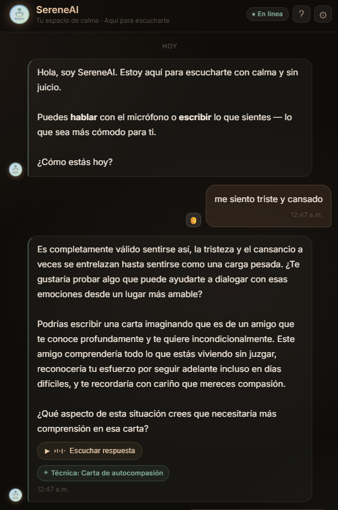
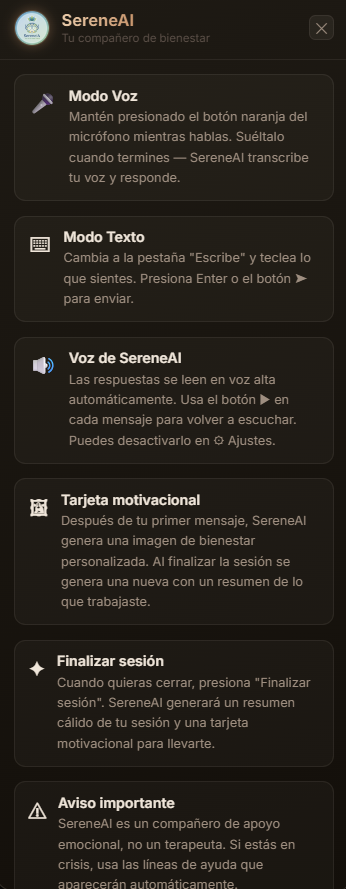
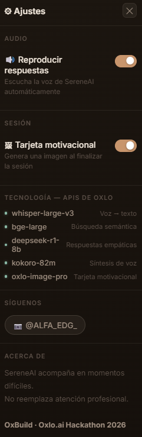
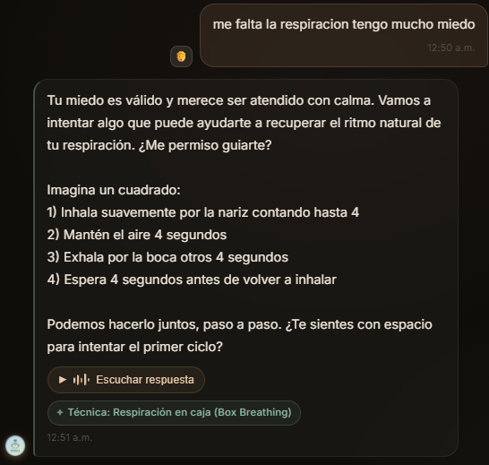
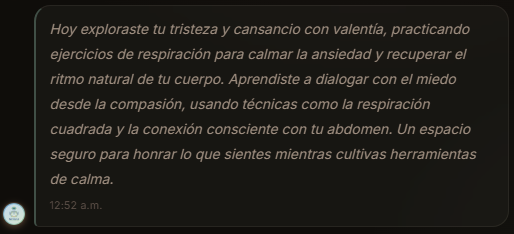

# SereneAI 🌿

> **"Habla. Te escucho. Respiremos juntos."**

Companion de salud mental con inteligencia artificial, voz natural y búsqueda semántica.  
Desarrollado para el hackathon **OxBuild · Oxlo.ai · 2026**.

---

## Demo en vivo

| | |
|---|---|
| **Frontend (Vercel)** | https://serene-ai-seven.vercel.app/ |
| **Backend API (Railway)** | https://web-production-49c1e.up.railway.app/ |
| **Swagger / Docs** | https://web-production-49c1e.up.railway.app/docs |
| **Repositorio** | https://github.com/ALFA117/SereneAI |
| **Video demo** | https://youtu.be/CDG0c7wVv3M?si=5rpsfiSD-2jbDSJf |

---

## Video demo

[](https://youtu.be/CDG0c7wVv3M?si=5rpsfiSD-2jbDSJf)

---

## Caso de uso

SereneAI permite a cualquier persona hablar libremente sobre cómo se siente y recibir:

- **Apoyo emocional inmediato** por voz sintetizada
- **Técnicas de bienestar validadas** recuperadas mediante búsqueda semántica (RAG)
- **Respuestas empáticas** generadas por un LLM con instrucciones éticas estrictas
- **Detección automática de crisis** con derivación a líneas de ayuda profesionales
- **Tarjeta motivacional visual** al cerrar la sesión, descargable con marca de agua

No reemplaza la terapia profesional: la complementa y facilita el acceso en el primer momento de necesidad.

---

## Métricas del proyecto

| | |
|---|---|
| Técnicas clínicas en la base de conocimiento | **53** |
| APIs de Oxlo integradas en un solo flujo | **5** |
| Dimensiones por vector de embedding (BGE-Large) | **1 024** |
| Keywords de detección de crisis | **25+** |
| Tiempo de respuesta promedio | **~3–5 s** |

---

## Capturas de pantalla

| Chat empático | Guía de uso | Ajustes y APIs |
|:---:|:---:|:---:|
|  |  |  |

| Chip RAG visible | Tarjeta motivacional | Resumen de sesión |
|:---:|:---:|:---:|
|  |  |  |

| Descarga con marca de agua |
|:---:|
|  |

---

## Modelos de Oxlo utilizados

| Modelo | Función en SereneAI |
|--------|---------------------|
| `whisper-large-v3` | Transcripción de voz → texto (soporte WebM / MP4 / OGG) |
| `bge-large` | Embeddings semánticos de 1 024 dimensiones para RAG |
| `deepseek-r1-8b` | Generación de respuestas empáticas con instrucciones éticas |
| `kokoro-82m` | Síntesis de voz natural (TTS) |
| `oxlo-image-pro` | Generación de tarjeta motivacional 1 024×1 024 |

---

## Arquitectura del sistema

```
Usuario (navegador)
    │
    │  1. Audio WebM/MP4/OGG  (MediaRecorder API)
    ▼
[FastAPI Backend — Railway]
    │
    ├─ POST /transcribe    ──► Oxlo Whisper Large v3  ──► texto
    │
    ├─ POST /chat
    │     ├─ Embed texto   ──► Oxlo BGE-Large  ──► vector 1024d
    │     ├─ Cosine sim    ──► knowledge_base.json (53 técnicas)
    │     ├─ Top-3 técnicas → system prompt enriquecido
    │     └─ LLM call      ──► Oxlo DeepSeek R1 8B  ──► respuesta
    │
    ├─ POST /synthesize    ──► Oxlo Kokoro 82M  ──► audio WAV base64
    │
    ├─ POST /generate-card ──► Oxlo Image Pro   ──► imagen 1024×1024
    │
    └─ POST /session-summary ──► DeepSeek R1 8B ──► resumen de sesión
    │
    ▼
Usuario (chip RAG · audio auto-play · tarjeta descargable con marca)
```

**RAG Pipeline:**
1. Al arrancar el servidor, los embeddings se generan automáticamente en background
2. Por cada mensaje: embed → coseno → top-3 técnicas → contexto inyectado al LLM
3. El LLM nunca inventa técnicas: solo usa las recuperadas del knowledge base
4. El nombre de la técnica principal se muestra como chip visible en el chat

---

## Instalación local

### Requisitos
- Python 3.11+
- API Key de Oxlo.ai

### Backend

```bash
git clone https://github.com/ALFA117/SereneAI
cd SereneAI/backend
pip install -r requirements.txt
cp ../.env.example ../.env
# Editar .env con tu OXLO_API_KEY
uvicorn main:app --reload --port 8000
```

Los embeddings se generan automáticamente al arrancar el servidor.

### Frontend

Abre `frontend/index.html` en el navegador o sirve con:

```bash
python -m http.server 5500 --directory frontend
# Luego abre: http://localhost:5500
```

---

## Variables de entorno

| Variable | Descripción |
|----------|-------------|
| `OXLO_API_KEY` | API key de Oxlo.ai |
| `OXLO_BASE_URL` | URL base de la API (default: `https://api.oxlo.ai/v1`) |
| `CORS_ORIGINS` | Orígenes permitidos para CORS (separados por coma) |

---

## Estructura del proyecto

```
SereneAI/
├── backend/
│   ├── main.py                    # FastAPI — 7 endpoints + RAG pipeline
│   ├── sereneai_system_prompt.py  # System prompt, crisis detection, limpieza R1
│   ├── requirements.txt
│   └── test_api.py
├── frontend/
│   ├── index.html                 # SPA: chat + voz + tarjeta + ayuda + ajustes
│   └── logo.png                   # Logo SereneAI (circular en toda la UI)
├── data/
│   ├── knowledge_base.json        # 53 técnicas clínicas validadas
│   └── embeddings.json            # Generado en runtime (excluido de git)
├── docs/
│   ├── screenshot-chat.png
│   ├── screenshot-help.png
│   ├── screenshot-settings.png
│   ├── screenshot-rag-chip.png
│   ├── screenshot-card.png
│   ├── screenshot-summary.png
│   └── screenshot-download.png
├── logo/
│   └── SereneIA.png
├── .env.example
├── .gitignore
├── Procfile
├── railway.json
└── README.md
```

---

## Endpoints de la API

| Método | Ruta | Descripción |
|--------|------|-------------|
| GET | `/health` | Estado: KB cargado + embeddings en caché |
| POST | `/generate-embeddings` | Genera embeddings de las 53 técnicas (incremental) |
| POST | `/transcribe` | Transcribe audio con Whisper Large v3 |
| POST | `/chat` | Pipeline RAG completo: embed → retrieval → LLM |
| POST | `/synthesize` | Convierte texto a audio WAV (base64) con Kokoro 82M |
| POST | `/generate-card` | Genera imagen motivacional 1 024×1 024 con Image Pro |
| POST | `/session-summary` | Resumen empático de la sesión con DeepSeek R1 |

---

## Seguridad y ética

- El sistema **nunca hace diagnósticos clínicos** ni recomienda medicamentos
- El system prompt incluye reglas explícitas contra minimizar el dolor del usuario
- Detección automática de crisis con 25+ keywords — respuesta fija (no generada por LLM):
  - **SAPTEL México:** 55 5259-8121 (24 horas)
  - **Línea de la Vida:** 800 911-2000 (gratuita, 24 horas)
  - **IMSS Salud Mental:** 800 890-0024

---

## Cuentas registradas

| Plataforma | Email |
|------------|-------|
| **Oxlo.ai** | elopezbaeza705@gmail.com |
| **DoraHacks** | edgarlopezbaeza.ing@gmail.com |

---

Hackathon OxBuild · Oxlo.ai · 2026 · [@ALFA_EDG_](https://instagram.com/ALFA_EDG_)
